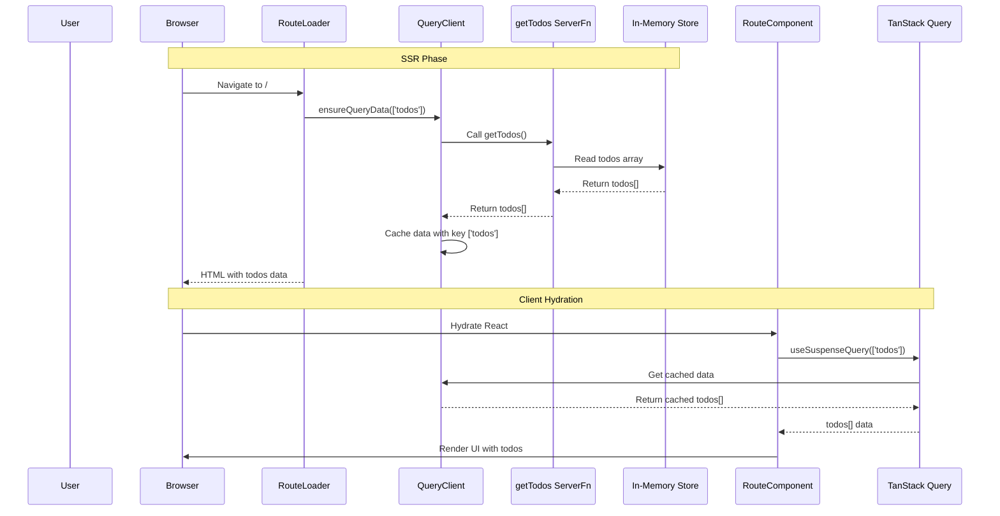
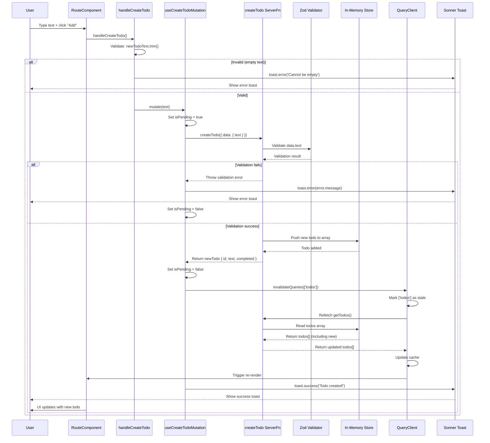
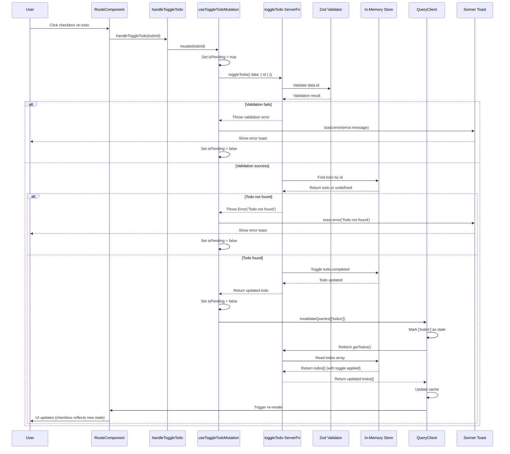
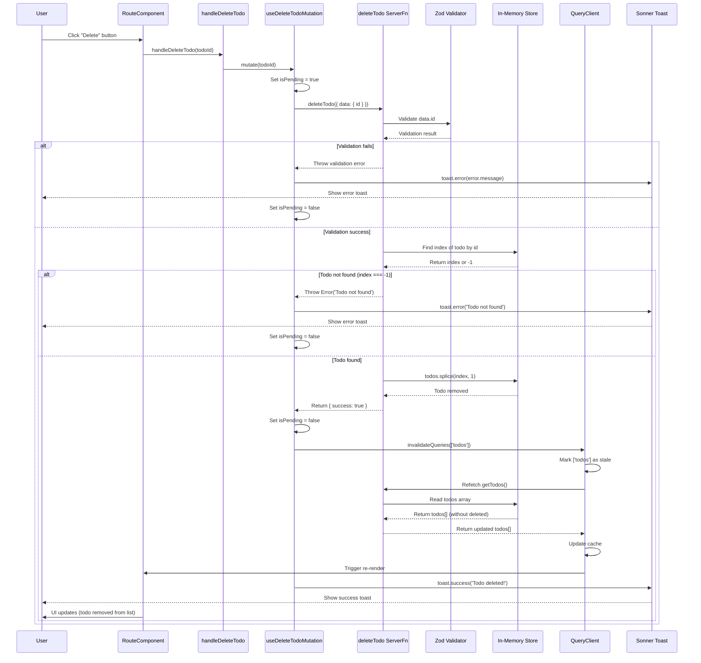
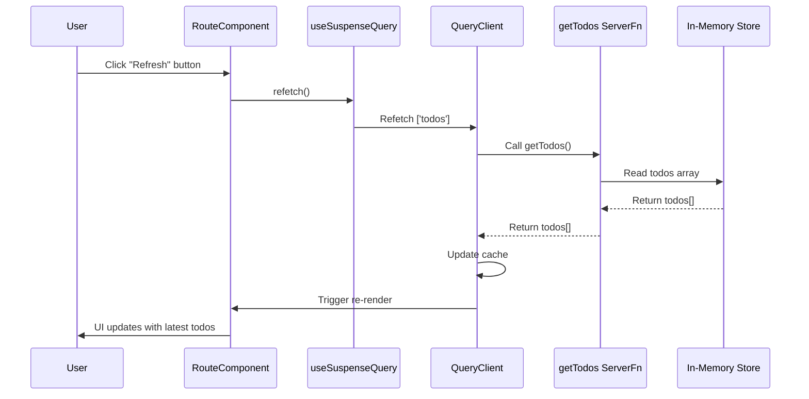

# Todos Architecture - Sequence Diagram

This document describes the complete flow of the todos functionality using TanStack Start, TanStack Query, and Server Functions.

## Architecture Overview

The todos system follows a server-first architecture:
- **Route Loader**: Prefetches data on SSR and navigation
- **TanStack Query**: Manages server state with caching and invalidation
- **Server Functions**: Type-safe backend functions with Zod validation
- **In-Memory Store**: Simple array-based storage (demo only)

## Sequence Diagrams

### 1. Initial Page Load (SSR + Hydration)



### 2. Create Todo Flow



### 3. Toggle Todo (Complete/Uncomplete)



### 4. Delete Todo Flow



### 5. Manual Refresh Flow



## Key Components

### Route Loader (`src/routes/(marketing)/index.tsx`)
```typescript
loader: async (opts) => {
  await opts.context.queryClient.ensureQueryData(todosQueries.list());
}
```
- Runs on SSR (server) and client navigation
- Prefetches todos data before component renders
- Seeds QueryClient cache for instant hydration

### TanStack Query Integration
- **Query Key**: `['todos']`
- **Stale Time**: 5 minutes (1000 * 60 * 5)
- **Suspense**: Uses `useSuspenseQuery` for automatic loading states

### Server Functions (`src/server/function/todos.ts`)
- **getTodos**: GET handler, returns all todos
- **createTodo**: POST handler with Zod validation, creates new todo
- **toggleTodo**: POST handler, toggles completed status
- **deleteTodo**: POST handler, removes todo from array

### Error Handling
- Zod validation errors caught in mutation
- Server-side errors (e.g., "Todo not found") caught in mutation
- All errors displayed via Sonner toast notifications

### State Management
- **Server State**: Managed by TanStack Query
- **UI State**: Local React state (`newTodoText`, `getResponse`, `postResponse`)
- **Storage**: In-memory array (demo only - would use database in production)

## Data Flow Summary

1. **Read**: Route Loader → QueryClient → Server Function → In-Memory Store
2. **Create/Update/Delete**: Component → Mutation → Server Function → Store → QueryClient Invalidation → Refetch
3. **UI Updates**: QueryClient cache updates → React Query triggers re-render

## Best Practices Implemented

✅ Fetch in route loaders (not `useEffect`)  
✅ Server functions for backend logic  
✅ Zod validation for type safety  
✅ Query invalidation after mutations  
✅ Toast notifications for user feedback  
✅ Suspense for loading states  
✅ SSR support with hydration  

